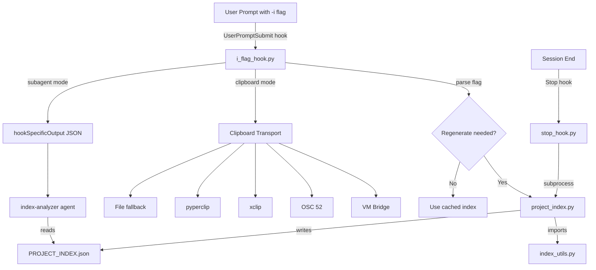

# Architecture Overview

**Codebase:** claude-code-project-index
**Analysis Date:** 2026-03-17
**Author:** Eric Buess (community tool)

## Architectural Pattern

**Hook-driven event pipeline** with two triggering paths, both mediated by Claude Code's native hook system:

- **Path A: Interactive (UserPromptSubmit hook)** — User prompt with `-i` flag -> `i_flag_hook.py` (flag detection, staleness check) -> `project_index.py` (index generation) -> `hookSpecificOutput.additionalContext` (injected into Claude session)
- **Path B: Maintenance (Stop hook)** — Session end -> `stop_hook.py` -> `project_index.py` (unconditional regeneration) -> refreshed `PROJECT_INDEX.json` on disk
- **Path C: Manual** — `/index` slash command invokes generator directly, bypassing hooks

## Core Components

| Component | File | Responsibility |
|-----------|------|----------------|
| **Hook Orchestrator** | `scripts/i_flag_hook.py` | Flag parsing, staleness detection, generation dispatch, clipboard transport, context injection |
| **Index Generator** | `scripts/project_index.py` | Stateless producer: build index -> densify -> compress -> write JSON |
| **Parsing Utilities** | `scripts/index_utils.py` | Regex-based signature extraction (Python, JS/TS, Shell), gitignore filtering, call graph construction |
| **Stop Hook** | `scripts/stop_hook.py` | Post-session index refresh (unconditional) |
| **Subagent** | `agents/index-analyzer.md` | Reads PROJECT_INDEX.json, provides structured code intelligence analysis |
| **Installer** | `install.sh` | OS detection, Python discovery, hook registration in settings.json, command/agent installation |
| **Python Shim** | `scripts/run_python.sh` | Reads cached `.python_cmd` and execs Python scripts at hook invocation time |

## Separation of Concerns

Three clearly bounded layers:

1. **Hook Orchestration Layer** (`i_flag_hook.py`, `stop_hook.py`) — Consumes Claude Code's hook protocol (JSON stdin/stdout), owns lifecycle decisions, handles clipboard transport. Does NOT contain parsing logic.

2. **Index Generation Layer** (`project_index.py`) — Stateless producer. Reads filesystem, writes `PROJECT_INDEX.json`. Receives configuration exclusively via `INDEX_TARGET_SIZE_K` env var. Has no knowledge of hooks, clipboard, or Claude sessions.

3. **Parsing/Utilities Layer** (`index_utils.py`) — Pure functions for regex-based signature extraction, shared constants, gitignore filtering, call graph construction.

4. **Consumption Layer** (`agents/index-analyzer.md`) — Prompt-defined subagent decoupled from generation; reads the filesystem artifact.

## Inter-Component Communication

| Boundary | Mechanism | Data |
|----------|-----------|------|
| Claude Code -> Hook | stdin JSON | `{"prompt": "..."}` |
| Hook -> Claude Code | stdout JSON | `{"hookSpecificOutput": {"additionalContext": "..."}}` |
| Hook -> Generator | subprocess + env var | `INDEX_TARGET_SIZE_K=50` |
| Generator -> Disk | file write | `PROJECT_INDEX.json` (minified) |
| Generator <- Utils | Python import | shared functions and constants |
| Subagent -> Index | file read | `PROJECT_INDEX.json` |
| Staleness cache | in-place JSON field | `_meta.files_hash`, `_meta.last_interactive_size_k` |

The `PROJECT_INDEX.json` file serves a dual role: both the output artifact AND the cache control store (via `_meta` block).

## Modularity & Coupling

**Coupling — mostly loose with two exceptions:**

- `project_index.py` imports directly from `index_utils.py` — hard coupling but appropriate for co-located utilities
- `i_flag_hook.py` contains hardcoded IP addresses (`10.211.55.2`, etc.) and paths for the original author's VM Bridge setup — portability concern
- Hooks call generator via subprocess (loose coupling via process boundary)
- Subagent reads filesystem artifact (loosest possible coupling)

**Cohesion:**

- `project_index.py` — HIGH: sequential pipeline (build -> densify -> compress -> write)
- `index_utils.py` — HIGH: pure utility module with no side effects
- `stop_hook.py` — VERY HIGH: single responsibility, minimal code
- `i_flag_hook.py` — LOW: six distinct responsibilities in one file (flag parsing, root detection, staleness checking, generation orchestration, clipboard handling with 5 transport strategies, context injection). The `copy_to_clipboard` function alone is ~300 lines.

## Strengths

- **Opt-in via artifact presence** — Both hooks check for `PROJECT_INDEX.json` before acting. Projects without the file are unaffected.
- **Content-hash staleness detection** — git-aware file hashing skips unnecessary regeneration
- **Progressive compression** — 5-step waterfall degrades gracefully for large codebases
- **Dual-graph indexing** — Both `calls` and `called_by` stored per function for bidirectional traversal
- **Size memory** — `_meta.last_interactive_size_k` gives project-scoped memory without external state
- **Subagent as consumption boundary** — Preserves main agent's context window

## Concerns

- `i_flag_hook.py` is a god module for clipboard transport (300+ lines, 5 transport strategies, hardcoded IPs)
- Stop hook always regenerates unconditionally — no staleness check reuse
- Token estimation is naive (`len(json) // 4` chars-per-token)
- Regex-based parsing has known failure modes (multi-line signatures with `)` in string literals)
- `build_call_graph` in `index_utils.py` is defined but unused (dead code) — call graph built inline in `project_index.py`
- No JSON validation between generation and metadata update — corrupt generator output corrupts `_meta`
- `stop_hook.py` writes to stdout before JSON, which may corrupt hook protocol
