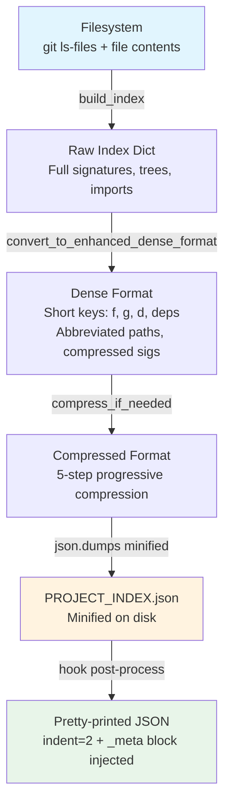

# Data Flow Analysis

## Overview

Data flows through a four-stage lossy compression pipeline, triggered by two independent hook paths and one manual CLI path. The `PROJECT_INDEX.json` file serves a dual role: both the output artifact AND the cache control store for staleness detection.

## Data Sources

| Source | Consumer | Mechanism |
|--------|----------|-----------|
| User prompt | `i_flag_hook.py:570` | `json.load(sys.stdin)` — only `prompt` field consumed |
| Filesystem (git) | `index_utils.py:1395`, `i_flag_hook.py:108` | `git ls-files --cached --others --exclude-standard` (called twice per cycle) |
| File contents | `project_index.py:221` | `read_text(encoding='utf-8', errors='ignore')` — non-UTF-8 silently dropped |
| `PROJECT_INDEX.json._meta` | `i_flag_hook.py:148,52` | Read for staleness detection and remembered size |
| `INDEX_TARGET_SIZE_K` env var | `project_index.py:713` | Token budget from hook to generator subprocess |
| `.python_cmd` file | `i_flag_hook.py:191`, `stop_hook.py:46` | Cached Python interpreter path |

## Data Transformation Pipeline



### Stage 1: `build_index()` (project_index.py:109)
- Walks project files (prefers `git ls-files`, falls back to `rglob`)
- Dispatches to language-specific parsers (`extract_python_signatures`, etc.)
- Builds forward call graph (`calls`) and reverse graph (`called_by`) inline
- Extracts markdown structure, infers directory purposes
- Output: Full dict with `indexed_at`, `root`, `project_structure`, `files`, `dependency_graph`, etc.

### Stage 2: `convert_to_enhanced_dense_format()` (project_index.py:404)
- Path abbreviation: `scripts/` → `s/`, `src/` → `sr/`, `tests/` → `t/`
- Language → single char: python=`p`, js=`j`, ts=`t`, shell=`s`
- Function records → colon-delimited strings: `"name:line:sig:calls:doc"`
- Signature compression: `' -> '` → `>`, `': '` → `:`
- Call graph edges → deduplicated `[[caller, callee], ...]` pairs
- Doc sections capped at 10 per file
- Unparsed files silently dropped

### Stage 3: `compress_if_needed()` (project_index.py:529)
Progressive 5-step waterfall (each step re-measures, returns early if within budget):
1. Reduce tree to 10 items
2. Truncate docstrings to 40 chars
3. Remove docstrings entirely (set to empty string)
4. Remove documentation map (`d` key)
5. Emergency: keep only top-N files ranked by function count

### Stage 4: Minified JSON write
`json.dumps(index, separators=(',', ':'))` → `PROJECT_INDEX.json`

### Stage 5 (hook only): Pretty-print overwrite
`generate_index_at_size` reads the minified JSON back, measures actual token size, injects `_meta` block, and overwrites with `indent=2`. The stop hook skips this — so the file format depends on which path last wrote it.

## Data Persistence

| Artifact | Writer | Location | Format |
|----------|--------|----------|--------|
| `PROJECT_INDEX.json` | project_index.py (minified) or i_flag_hook.py (pretty) | Project root | JSON |
| `_meta` block | i_flag_hook.py only | Inside PROJECT_INDEX.json | JSON fields |
| `.clipboard_content.txt` | i_flag_hook.py | Project root | Plain text |
| `.python_cmd` | install.sh | `~/.claude-code-project-index/` | Plain text |

## The `_meta` Block: Dual-Purpose Design

```json
{
  "_meta": {
    "generated_at": 1710000000.0,
    "target_size_k": 50,
    "actual_size_k": 12,
    "files_hash": "a1b2c3d4e5f6g7h8",
    "compression_ratio": "24.0%",
    "last_interactive_size_k": 50
  }
}
```

- **As metadata**: `target_size_k`, `actual_size_k`, `compression_ratio` describe the generation run
- **As cache control**: `files_hash` (SHA256[:16] of file paths + mtimes) and `target_size_k` are read by `should_regenerate_index` to decide if regeneration is needed
- **As persistent state**: `last_interactive_size_k` is the "remembered size" feature — stored only for `-i` runs (not `-ic`)

**Important**: The stop hook regeneration does NOT update `_meta` (it runs project_index.py directly with no post-processing). After a stop-hook regeneration, `_meta` retains stale values from the previous interactive invocation. The next `-i` run detects the mismatch and regenerates.

## Control Flow Paths

### Path A: `-i[N]` (standard subagent mode)
```
stdin JSON → parse_index_flag → size_k set, clipboard_mode=False
  → should_regenerate_index (reads _meta.files_hash, _meta.target_size_k)
    ├─ No regen → skip subprocess
    └─ Regen → subprocess(project_index.py, env={INDEX_TARGET_SIZE_K: N}, timeout=30)
         → re-read PROJECT_INDEX.json → inject _meta → overwrite with indent=2
  → build additionalContext JSON with subagent instructions
  → print(json.dumps(output)) → sys.exit(0)
```

### Path B: `-ic[N]` (clipboard mode)
Same through index generation, then → `copy_to_clipboard()` transport cascade:
1. VM Bridge network (probe 3 hardcoded IPs)
2. VM Bridge tunnel (localhost)
3. SSH detection → OSC 52 (small) or tmux buffer + manual sync (large)
4. xclip (with optional Xvfb)
5. pyperclip
6. File fallback

### Path C: Stop hook (maintenance)
```
(no stdin) → walk up directories for PROJECT_INDEX.json
  → chdir(project_root) → subprocess(project_index.py, timeout=10)
  → print status + JSON to stdout
```

## Error Handling

**Design principle**: Non-blocking degradation. Every error path falls through to a working state or `sys.exit(0)`.

| Pattern | Location | Behavior |
|---------|----------|----------|
| Bare `except: pass` | i_flag_hook.py:60, 133, 280-298 | Swallowed; falls back to defaults |
| `TimeoutExpired` | i_flag_hook.py:252, stop_hook.py:80 | Warning to stderr, continues |
| Per-file parse error | project_index.py:243 | Increments `listed_only` stats, skips file |
| JSON decode error | i_flag_hook.py:771 | Prints error, `sys.exit(1)` |
| Generic Exception | i_flag_hook.py:774 | Prints error, `sys.exit(1)` |

**Subprocess timeouts**:
- `calculate_files_hash`: 5s
- `get_git_files`: 10s
- Stop hook generation: 10s
- Interactive generation: 30s

## Unusual Patterns

1. **Double stdout in stop_hook.py** (lines 74-75): `print()` emits a non-JSON line before `sys.stdout.write(json.dumps(output))` — could corrupt hook protocol parsing

2. **Pretty-print overwrite**: project_index.py writes minified; hook overwrites with indent=2. File format depends on last writer.

3. **Behavioral override via context injection**: `-ic` paths embed `CRITICAL INSTRUCTION FOR CLAUDE: STOP!` in `additionalContext` — using hook mechanism as prompt injection

4. **Hardcoded IPs**: `10.211.55.2`, `10.211.55.1`, `192.168.1.1` (VM Bridge probes), `10.211.55.4` (SSH sync) — Parallels VM-specific

5. **Dead `call_graph` key**: `extract_python_signatures` initializes `result['call_graph'] = {}` (index_utils.py:171) but never populates it; call graph built separately in project_index.py

6. **Non-functional iteration guard**: `compress_if_needed` has `MAX_ITERATIONS = 10` but only 5 sequential steps — guard can never fire

7. **Duplicate git ls-files calls**: Both `calculate_files_hash` (hook) and `get_git_files` (indexer) independently invoke `git ls-files` per generation cycle

## Token Estimation

Both the hook and generator use `len(json_string) // 4` as the chars-per-token estimate. This is a rough approximation — real tokenization varies by content type. The formula underestimates tokens for dense JSON with short keys and overestimates for natural language content.
