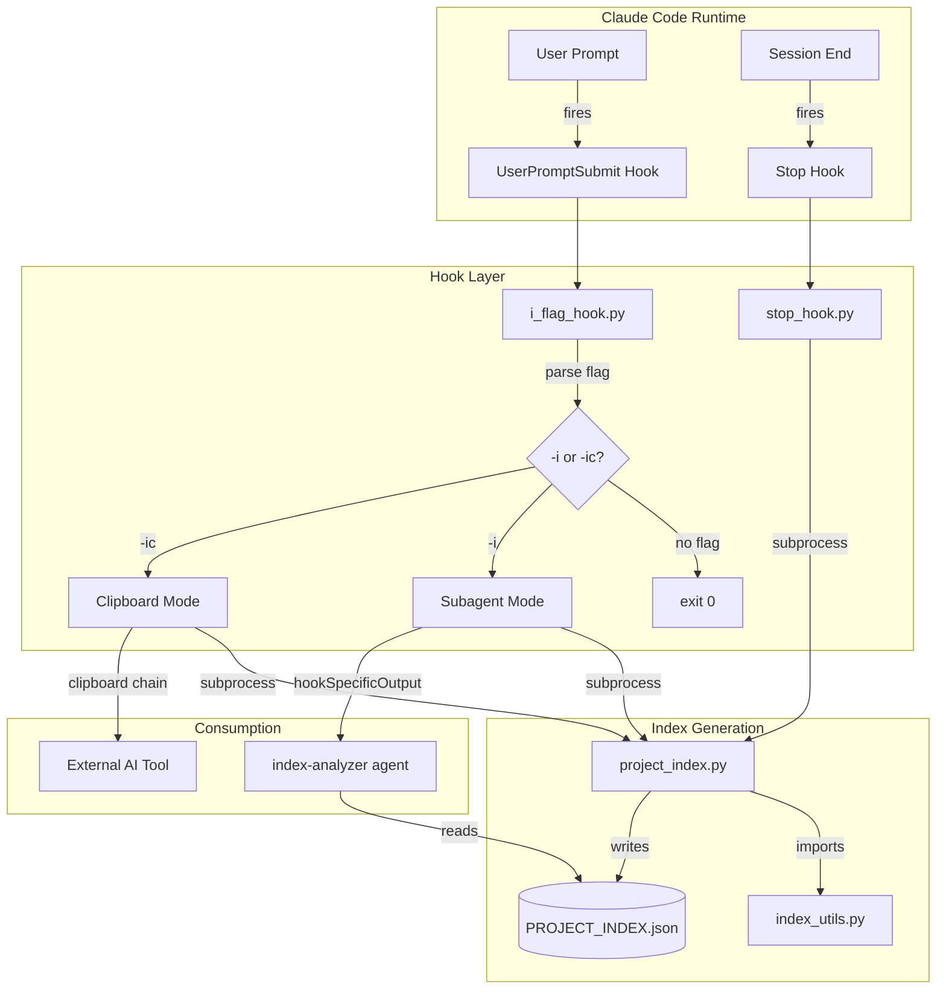

# Architecture Overview

**Codebase:** claude-code-project-index
**Analysis Date:** 2026-03-17 02:48 UTC

## Architectural Pattern

The system implements a **hook-driven ETL pipeline** with event-driven triggering. It activates entirely through Claude Code's `UserPromptSubmit` and `Stop` hook events, making it a **reactive, embedded toolchain** rather than a standalone service.

## Core Components

| Component | File | Responsibility |
|-----------|------|----------------|
| Hook Controller | `scripts/i_flag_hook.py` | Flag parsing, cache validation, subprocess orchestration, clipboard transport, hookSpecificOutput emission |
| Index Orchestrator | `scripts/project_index.py` | File discovery, call graph assembly, dense format conversion, 5-step compression pipeline |
| Parsing Engine | `scripts/index_utils.py` | Regex-based language parsers (Python, JS/TS, Shell), file filtering, gitignore handling, constants |
| Session Teardown | `scripts/stop_hook.py` | Unconditional index refresh at session end |
| AI Consumer | `agents/index-analyzer.md` | Subagent prompt for deep codebase analysis (Read/Grep/Glob tools only) |
| Bootstrap | `install.sh` | Hook registration, agent installation, Python path persistence |

## Separation of Concerns

The division between `project_index.py` (orchestration) and `index_utils.py` (parsing) is sound. The hook scripts are correctly isolated via subprocess boundaries.

**Weakness:** `i_flag_hook.py` has moderate cohesion issues — it mixes flag parsing, caching logic, subprocess management, and a large multi-strategy clipboard implementation (300+ lines) with hardcoded developer-specific configuration.

## Inter-Component Communication

| Mechanism | Used For |
|-----------|----------|
| **stdin/stdout JSON** | Hook protocol with Claude Code |
| **Environment variables** | `INDEX_TARGET_SIZE_K` config injection |
| **Filesystem** | `PROJECT_INDEX.json` as shared state |
| **Subprocess spawning** | Process isolation between hooks and indexer |

## Modularity & Coupling

- **Loose:** hooks ↔ indexer (subprocess + env + filesystem)
- **Tight (appropriate):** `project_index.py` → `index_utils.py` (direct import)
- **Implicit:** Dense format serialization ↔ compression logic (undocumented colon-delimited protocol)

## Strengths

- Progressive 5-step compression for variable project sizes
- Content-hash cache invalidation (SHA-256 over git-tracked file mtimes)
- Development-in-place script resolution (iterate without reinstalling)
- `git ls-files` preference (automatic `.gitignore` respect)
- Graceful degradation (timeouts, fallback chains)
- Subagent isolation (tool-limited, separate context)
- Zero external Python dependencies

## Concerns

- God Function: `copy_to_clipboard` (305 lines, 7 clipboard strategies)
- Hardcoded environment: Original author's IPs/paths/username in shared code
- Dead code: `build_call_graph` in `index_utils.py` never called
- No test suite: 0% coverage on complex regex parsers
- Stop hook overwrites metadata without preserving requested size
- Non-atomic file writes create race conditions
