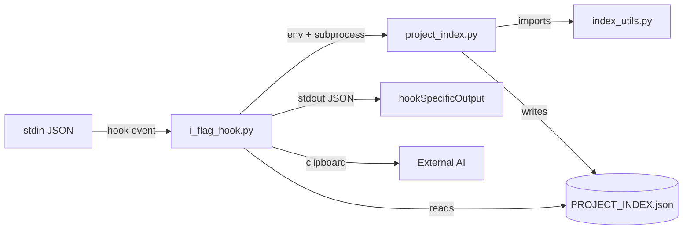

# Data Flow Analysis

## Overview

Three-process hook pipeline where each process boundary is a data serialization point:



## Data Sources

| Source | Entry Point | Validation |
|--------|-------------|------------|
| stdin JSON (`prompt`) | `i_flag_hook.py:570` | `json.load()` only |
| Source code files | `project_index.py:221` | `errors='ignore'` encoding |
| `git ls-files` output | `index_utils.py:1395` | Timeout + fallback to `Path.rglob` |
| `INDEX_TARGET_SIZE_K` env | `project_index.py:713` | None (no bounds/type check) |
| `.python_cmd` file | `i_flag_hook.py:189` | None (unvalidated executable) |
| `SSH_CONNECTION`/`TMUX` | `i_flag_hook.py:399,426` | Existence check only |

## Data Transformations

### 1. Prompt → Flag Parsing
`parse_index_flag()` extracts `-i[N]`/`-ic[N]` via regex. Size clamped to `[1, 100]` (subagent) or `[1, 800]` (clipboard). Flag stripped from cleaned prompt.

### 2. Source Code → Parsed Signatures
Three regex-based parsers, each using two-pass design:

| Parser | Function | Handles |
|--------|----------|---------|
| Python | `extract_python_signatures` (381 lines) | Functions, classes, async, decorators, docstrings, enums |
| JS/TS | `extract_javascript_signatures` (~355 lines) | ES/CJS modules, TS interfaces, arrow functions, classes |
| Shell | `extract_shell_signatures` (~255 lines) | `name(){}` and `function name{}`, parameter inference |

**Limitation:** Call detection only finds intra-file calls.

### 3. Signatures → Call Graph
Bidirectional: forward (`file:func` → `[callees]`) and reverse (`func` → `[callers]`). Cross-file calls not resolved.

### 4. Full Index → Dense Format
- Path abbreviation: `scripts/` → `s/`, `src/` → `sr/`, `tests/` → `t/`
- Language letters: `python` → `p`, `javascript` → `j`, `shell` → `s`
- Function format: `"name:line:signature:calls:docstring"` (colon-delimited string)

### 5. Dense → Compressed (5-step ladder)

| Step | Action |
|------|--------|
| 1 | Truncate tree to 10 items |
| 2 | Truncate docstrings to 40 chars |
| 3 | Strip docstrings entirely |
| 4 | Delete documentation map |
| 5 | Emergency: keep top-N files by function count |

## Data Persistence

| Artifact | Written By | Format | Notes |
|----------|-----------|--------|-------|
| `PROJECT_INDEX.json` | `project_index.py` then `i_flag_hook.py` | Minified → pretty JSON | Double-write pattern |
| `.clipboard_content.txt` | `i_flag_hook.py` | Plaintext | Fallback, written to CWD |
| `.python_cmd` | `install.sh` | Single-line text | Never updated |

## Clipboard Transport Chain (priority order)

1. **VM Bridge (network)** — tries 3 hardcoded LAN IPs
2. **VM Bridge (tunnel)** — localhost variant
3. **OSC 52** — SSH sessions, content ≤ 11KB
4. **tmux buffer** — SSH sessions, content > 11KB
5. **xclip** — local Linux (may start Xvfb)
6. **pyperclip** — Python library fallback
7. **File fallback** — `.clipboard_content.txt`

## Example Flow: `fix auth bug -i50`

```
stdin: {"prompt": "fix auth bug -i50"}
  → parse_index_flag() → size=50, cleaned="fix auth bug"
  → find_project_root() → git root or cwd
  → should_regenerate_index() → hash comparison
  → generate_index_at_size(50)
     → subprocess: project_index.py (INDEX_TARGET_SIZE_K=50)
        → build_index() → parse → call graph
        → convert_to_enhanced_dense_format()
        → compress_if_needed(200KB target)
        → write PROJECT_INDEX.json
     → hook adds _meta, re-writes
  → emit hookSpecificOutput → Claude invokes index-analyzer
```

## Validation Gaps

1. `.python_cmd` used as executable without validation
2. `USER` env var interpolated into SSH command without sanitization
3. No schema validation of `PROJECT_INDEX.json` on read
4. `INDEX_TARGET_SIZE_K` parsed without bounds guard
5. Token estimation (`len(str) // 4`) is approximate
