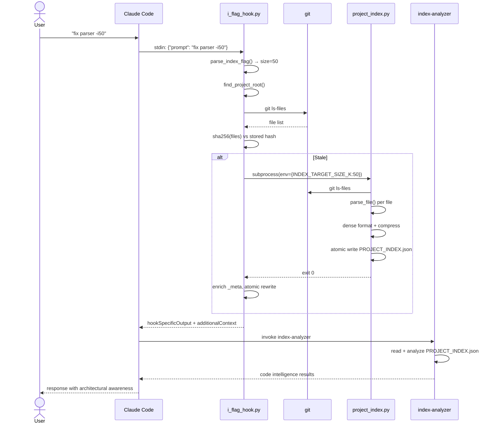

# Control Flow and Data Flow Analysis

**Date:** 2026-03-17

## Entry Point Inventory

| Entry Point | Trigger | Stdin | Stdout |
|-------------|---------|-------|--------|
| `i_flag_hook.py:main()` (line 530) | UserPromptSubmit hook | JSON `{"prompt": "..."}` | JSON `{"hookSpecificOutput": {...}}` |
| `stop_hook.py:main()` (line 71) | Stop hook | None | JSON `{"suppressOutput": bool}` |
| `project_index.py:main()` (line 718) | CLI or subprocess | None | Console output |

## Critical Execution Path: `-i` Flag (Subagent Mode)

```
User prompt "fix parser -i50"
    → i_flag_hook.py:main()
        → parse_index_flag(prompt)           [line 100]
            regex: r'-i(c?)(\d+)?(?:\s|$)'
            Returns: size_k=50, clipboard=False, cleaned="fix parser"
        → find_project_root()                [line 59]
            Walk up for .git directory
        → should_regenerate_index()          [line 172]
            Read _meta.files_hash from PROJECT_INDEX.json
            git ls-files → sha256(path:mtime)[:16]
            Compare hashes + size tolerance (2k)
        → [if stale] generate_index_at_size() [line 204]
            Locate indexer + validate Python cmd
            subprocess.run([python, indexer], env={INDEX_TARGET_SIZE_K: 50}, timeout=30)
                → project_index.py:main()
                    → build_index('.')       [line 129]
                        git ls-files → for each file: parse_file(content, ext)
                        PARSER_REGISTRY dispatch → signatures + calls
                        Build dependency_graph + bidirectional call_graph
                    → convert_to_enhanced_dense_format() [line 415]
                        Key compression (files→f, graph→g, docs→d)
                        Path abbreviation (scripts/→s/)
                        Signature format: "name:line:sig:calls:doc"
                    → compress_if_needed()   [line 539]
                        5-step progressive: tree→docs→docstrings→doc_map→file_cull
                    → Atomic write: mkstemp + os.replace [line 752]
            Re-read PROJECT_INDEX.json
            Inject _meta (files_hash, target_size_k, actual_size_k, etc.)
            Atomic write again (pretty-printed with _meta)
        → Build hookSpecificOutput
            additionalContext = "Index-Aware Mode Activated..."
        → print(json.dumps(output))
    → Claude invokes index-analyzer subagent
        → Subagent reads PROJECT_INDEX.json
```

## Data Transformation Stages

```
Stage 1: Raw prompt → Flag parameters (regex)
Stage 2: Filesystem state → Staleness boolean (hash comparison)
Stage 3: Source files → Parsed signatures (PARSER_REGISTRY dispatch)
Stage 4: Parsed dicts → Dense format (key compression, path abbreviation)
Stage 5: Dense format → Size-constrained format (progressive compression)
Stage 6: Dict → JSON file (atomic write: mkstemp + os.replace)
Stage 7: File content → Hook output JSON (context injection or clipboard)
```

## State Management

All state is in `PROJECT_INDEX.json._meta`:

| Field | Written by | Read by | Purpose |
|-------|-----------|---------|---------|
| `files_hash` | i_flag_hook | i_flag_hook, stop_hook | Staleness detection |
| `target_size_k` | i_flag_hook | i_flag_hook | Size tolerance check |
| `last_interactive_size_k` | i_flag_hook | i_flag_hook | Remember last `-i` size |
| `generated_at` | i_flag_hook | (audit only) | Timestamp |

No in-memory state between invocations. Each hook is a fresh process.

## Error Handling Assessment

**Overall: Robust, fail-open design.**

- `i_flag_hook.py`: Outer try/except catches all exceptions → exit(1). Inner subprocess has 30s timeout. Parse failures demote files to listed-only.
- `stop_hook.py`: `should_regenerate()` returns True on any exception (fail-open). 10s subprocess timeout. Never interrupts user workflow.
- `project_index.py`: Per-file parse errors caught individually, file demoted. PermissionError in tree generation silently ignored. Atomic write has fd cleanup in finally block.
- All hooks exit(0) on failure paths — never block Claude Code.

## Key Issues Found

1. **Double write**: indexer writes minified JSON, hook rewrites as pretty-printed with _meta
2. **Stop hook ignores `last_interactive_size_k`**: regenerates at MAX_INDEX_SIZE (1MB) default
3. **`ssh_file_large` transport type in `_build_hook_output` is dead code** — no transport returns it
4. **Hash logic duplicated** between `calculate_files_hash()` (i_flag_hook) and inline in `should_regenerate()` (stop_hook)

## Sequence Diagram


